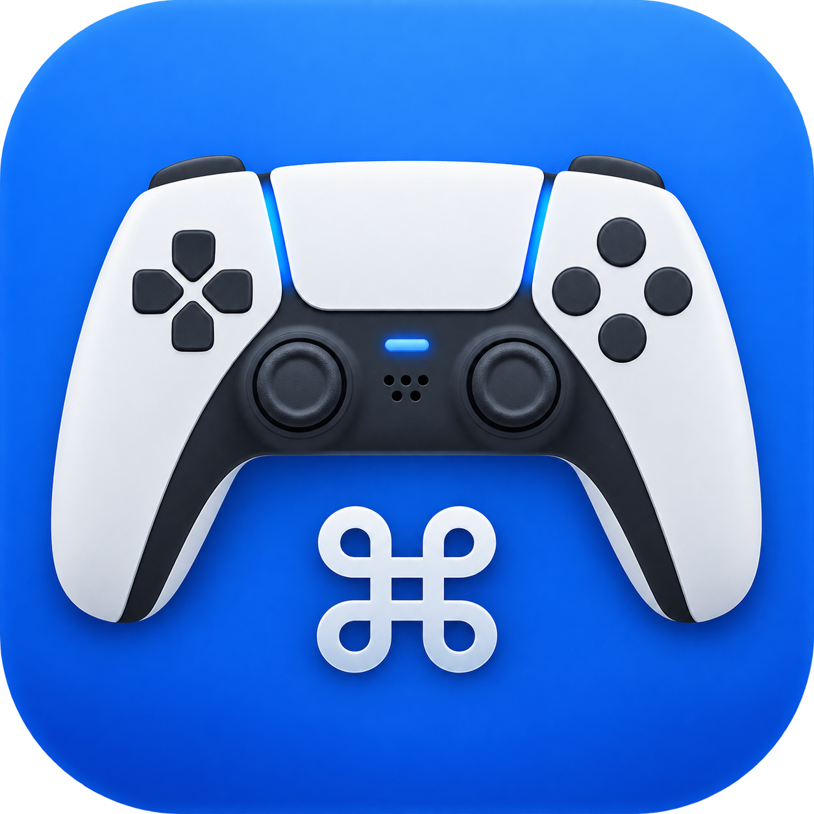
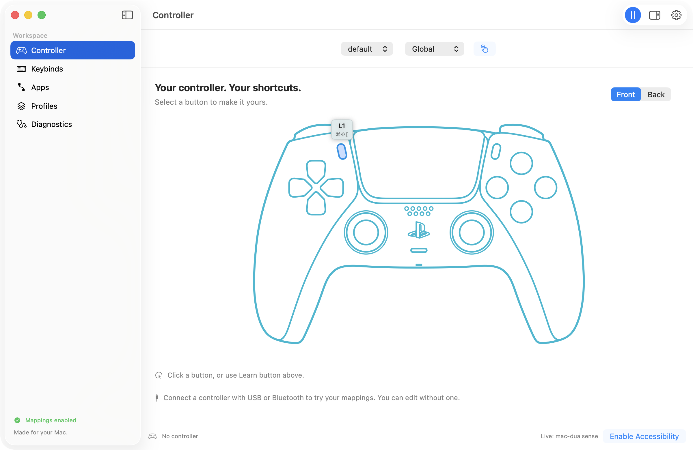
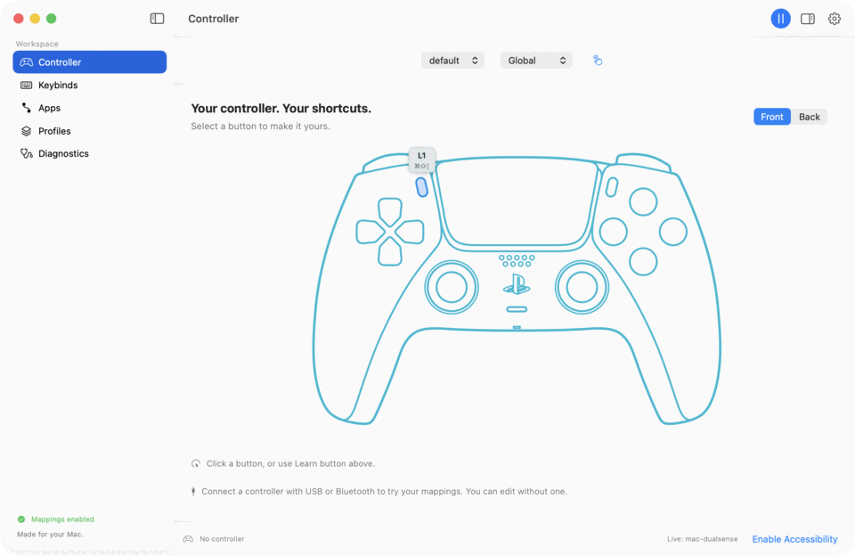

<p align="center">
  
</p>
<h1 align="center">mac-dualsense</h1>
<p align="center"><strong>Your controller. Your Mac. Your shortcuts.</strong></p>
<p align="center">A native menu bar companion that turns a game controller into a shortcut remote.</p>
<p align="center">
  
  
  <a href="LICENSE"></a>
  <a href="https://github.com/sour4bh/mac-dualsense/actions/workflows/ci.yml"></a>
</p>
<p align="center"><a href="#get-started">Get started</a> · <a href="docs/configuration.md">Configuration</a> · <a href="CONTRIBUTING.md">Contribute</a> · <a href="docs/troubleshooting.md">Help</a></p>

<picture>
  <source media="(prefers-color-scheme: dark)" srcset="docs/assets/controller-dark.png">
  
</picture>

Scroll through a browser, switch terminal tabs, or trigger voice dictation from your controller. Mappings follow the app you’re using, with a global fallback for everything else.

- **Make every button useful.** Select it on the controller, record a shortcut, and choose an app-specific override.
- **Bring your own apps.** Choose an installed app or enter its bundle ID. App associations work across all profiles.
- **Switch workflows.** Keep separate profiles for browsing, terminal work, and anything else.
- **Use the touchpad.** DualSense can move the pointer, scroll, and click, with sensitivity controls in Settings.
- **Stay out of the way.** Set up once, then keep it in the menu bar. Pause mappings whenever you need to.
- **Keep it local.** No account, analytics, or cloud service. [How permissions and logs work →](docs/privacy.md)

<details>
<summary>See the workspace in action</summary>



Captured from the app with an isolated sample configuration. No controller is connected in these screenshots.

</details>

## Get started

**Requires an Apple Silicon Mac running macOS 26 or later.** Source builds require Xcode 26+ with Swift 6.2 or later; CI uses Xcode 26.6.

The first signed release is being prepared. There is no public binary to download yet. Follow [Releases](https://github.com/sour4bh/mac-dualsense/releases) for availability, or build from source:

```sh
git clone https://github.com/sour4bh/mac-dualsense.git
cd mac-dualsense
make run
```

`make run` builds a local development app and opens it. `make install` builds and copies it to `/Applications` without launching. These local builds use an ad-hoc signature; they are not notarized distribution builds.

1. Connect a controller using USB or Bluetooth.
2. Follow setup to enable **mac-dualsense** in System Settings → Privacy & Security → Accessibility.
3. Try a controller button in the setup screen; shortcuts are paused during this test.
4. Open the workspace from the menu bar to customize buttons, apps, and profiles.

## Controller support

| Controller | Connection | Editing | Extras |
| --- | --- | --- | --- |
| Sony DualSense | USB / Bluetooth through macOS GameController | Visual front/back map and keybind list | Touchpad pointer, scrolling, clicks; haptics when supported |
| Nintendo Switch Pro Controller | USB / Bluetooth through macOS GameController | Keybind list | Availability of buttons and haptics depends on macOS/controller support |

Hardware testing status is recorded in [release validation](docs/validation.md). macOS may reserve system buttons. DualSense Edge paddles, adaptive trigger effects, and controller audio are not implemented.

## A few useful defaults

| Button | Global action |
| --- | --- |
| D-pad | Arrow keys |
| Cross / Circle | Return / Escape |
| Square | Tab |
| L1 / R1 | Previous / next tab shortcut |
| Triangle / PS | Voice dictation trigger |

Voice dictation sends a configurable modifier-key gesture. [Wispr Flow](https://wisprflow.ai/) is optional, installed separately, and must use the matching shortcut. It is not bundled or required for ordinary mappings.

Use **Apps** to associate applications, **Profiles** to switch mapping sets, and **Settings** for controller, dictation, haptic, and trackpad preferences. Advanced configuration lives in `~/Library/Application Support/mac-dualsense/mappings.yaml` and reloads on save. See the [configuration guide](docs/configuration.md).

## Built in the open

SwiftUI, GameController, and a small amount of AppKit. YAML parsing uses [Yams](https://github.com/jpsim/Yams); no extra drivers or background services are needed.

Bug reports, documentation improvements, controller test results, and pull requests are welcome. Start with [CONTRIBUTING.md](CONTRIBUTING.md).

[MIT](LICENSE) · [Acknowledgments](ACKNOWLEDGMENTS.md) · [Security](SECURITY.md)

An independent project, not affiliated with Sony, Nintendo, Apple, or Wispr.
